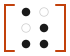

<picture>
  <source media="(prefers-color-scheme: dark)" srcset="./zagovor-logo-braille-dark.svg">
  
</picture>

# zagovor

**a prompt dialect** — *a precise spoken formula that makes something happen*

A small, hand-typed vocabulary for talking to an AI assistant in chat. Not a
compiler — the assistant still reads everything as natural language. The point is
*your* consistency: fixed words remove ambiguity and decision fatigue.

Named for the Slovene *zagovor*, a spoken charm-formula from folk tradition —
*what is performed with speech*.

See [`zagovor-v0.1.md`](./zagovor-v0.1.md) for the full spec and the
[cheat sheet](./zagovor-cheatsheet.pdf) for a one-page reference.

The cheat sheet source is [`zagovor-cheatsheet.typ`](./zagovor-cheatsheet.typ)
(Typst). To regenerate the PDF after editing it, run `./generate-pdf.sh` — it
uses a local `typst` if one is on `PATH`, otherwise it downloads a pinned
Typst release into `.typst-bin/` on first run (no system-wide install
needed).

---

## License

The **specification and documentation** in this project (the spec file, the cheat
sheet wording, and the examples) are licensed under
**Creative Commons Attribution 4.0 International (CC BY 4.0)**.

You are free to use, share, adapt, and build on this material — including
commercially — provided you give appropriate credit.

Full license text: https://creativecommons.org/licenses/by/4.0/legalcode
Summary: https://creativecommons.org/licenses/by/4.0/

Suggested attribution:
> Based on *zagovor* (https://github.com/sfiligoj/zagovor) by Gregor Sfiligoj, licensed under CC BY 4.0.

### Not covered by this license

The **name "zagovor"** and the **Braille logo / visual identity** are **reserved**
and are *not* licensed under CC BY 4.0. You may describe and reference the project
by name, but you may not use the name or logo to brand your own forks, products, or
distributions in a way that implies endorsement or origin.

### On the syntax itself

The vocabulary and syntax (the idea of writing `VERB target FLAG=value`) is a
method, not a protected work — you are free to write, speak, and implement
zagovor-style prompts however you like. The license above governs the *written
documentation*, not the act of using the dialect.

---

## Versioning

Current: **v0.1**. The vocabulary is versioned; bump the number when it changes and
keep a changelog so older saved prompts stay interpretable.

*Not legal advice — if you have specific concerns about publishing, consult a
lawyer.*
